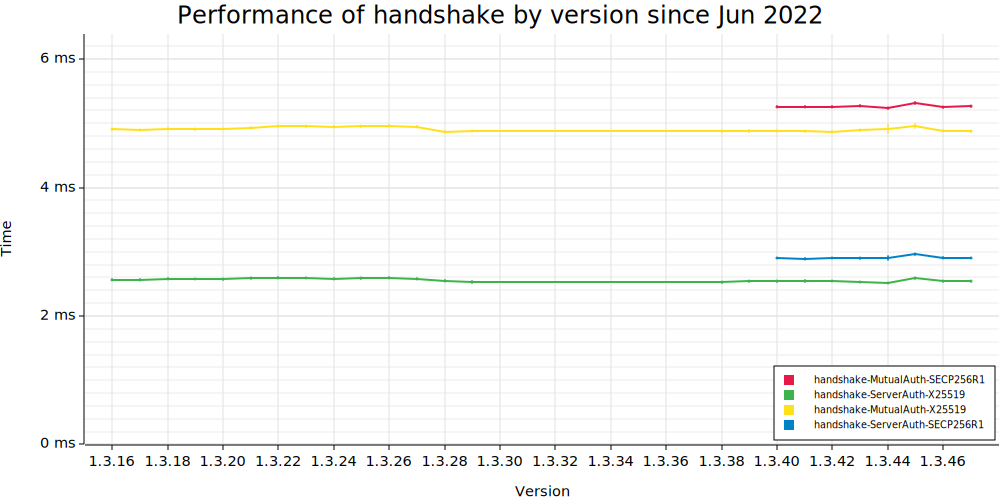
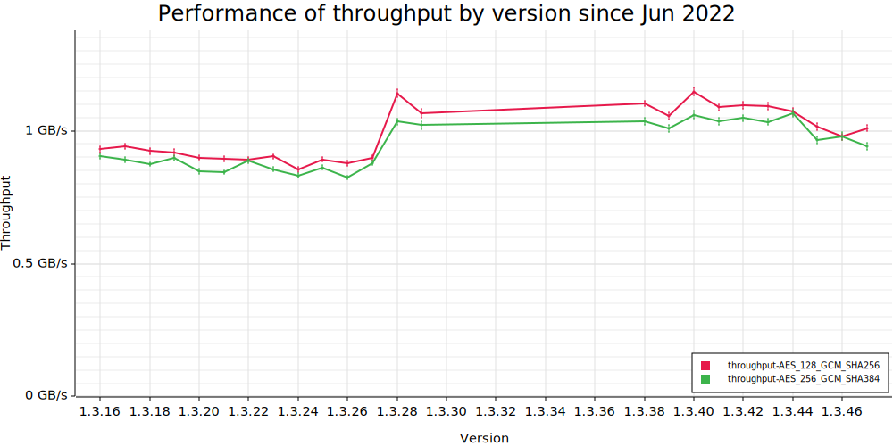

# Benchmarking s2n-tls

We use to Criterion.rs to benchmark s2n-tls against two commonly used TLS libraries, Rustls and OpenSSL.

All benchmarks are run in an idealized environment, using only a single thread and with custom IO bypassing the networking stack. As such, performance numbers will be different from in practice, but relative performance between the libraries should still be accurate.

## Quickstart

```
# generate rust bindings
../generate.sh

# set up bench crate
scripts/generate-certs.sh
scripts/install-aws-lc.sh

# run all benchmarks (s2n-tls with AWS-LC)
mkdir .cargo
cat aws-lc-config/s2n.toml > .cargo/config.toml
cargo bench
scripts/bench-memory.sh
cargo bench --bench handshake --bench throughput -- --profile-time 5
rm -rf .cargo
```

## Setup 

Setup is easy! Just have OpenSSL installed, generate Rust bindings for s2n-tls using `../generate.sh`, and generate certs using `scripts/generate-certs.sh`. 

Dependencies are the same as with s2n-tls. Currently, this crate has only been tested on Ubuntu (both x86 and ARM), but we expect everything to work with other Unix environments. 

To bench with AWS-LC, Amazon's custom libcrypto implementation, first run `scripts/install-aws-lc.sh` to install AWS-LC for the bench crate. To then run the benchmarks with AWS-LC, use Cargo with either the flag `--config aws-lc-config/s2n.toml` or `--config aws-lc-config/rustls.toml` (or both). You can also append these configs to `.cargo/config.toml` to let Cargo automatically detect the settings without specifying the flags each time.  

### Features

Default features (`rustls` and `openssl`) can be disabled by running the benches with `--no-default-features`. The non-default `memory` and `historical-perf` features are used to enable dependencies specific to those types of benches, and are automatically used by the scripts that run those benches.

## Performance benchmarks

The handshake and throughput benchmarks can be run with the `cargo bench` command. Criterion will auto-generate an HTML report in `target/criterion/`. 

Throughput benchmarks measure round-trip throughput with the client and server connections in the same thread for symmetry. In practice, a machine would either host only the client or only the server and use multiple threads, so throughput for a single connection could theoretically be up to ~4x higher than the values from the benchmarks (when run on the same machine).

To generate flamegraphs, run `cargo bench --bench handshake --bench throughput -- --profile-time 5`, which profiles each benchmark for 5 seconds and stores the resulting flamegraph in `target/criterion/[bench-name]/[lib-name]/profile/flamegraph.svg`.

## Memory benchmarks

To run all memory benchmarks, run `scripts/bench-memory.sh`. Graphs of memory usage will be generated in `images/`.

Memory benchmark data is generated using the `memory` binary. Command line arguments can be given to `cargo run` or to the built executable located at `target/release/memory`. The usage is as follows:

```
memory [(pair|client|server)] [(s2n-tls|rustls|openssl)] [--reuse-config (true|false)] [--shrink-buffers (true|false)]
```

- `(pair|client|server)`: target to memory bench, defaults to `server`
- `(s2n-tls|rustls|openssl)`: library to be benched, if unset benches all libraries
- `--reuse-config`: if `true` (default), reuse configs between connections
- `--shrink-buffers`: if `true` (default), shrink buffers owned by connections

To view a callgraph of memory usage, use [KCachegrind](https://github.com/KDE/kcachegrind) on `xtree.out` generated from memory benching:

```
kcachegrind target/memory/<params>/<target>/<library>/xtree.out
```

To view a flamegraph of memory usage, use [heaptrack](https://github.com/KDE/heaptrack) with `heaptrack_gui` also installed. Run heaptrack with the `memory` executable and target/library options:

```
heaptrack target/release/memory (pair|client|server) (s2n-tls|rustls|openssl)
```

## Historical benchmarks

To do historical benchmarks, run `scripts/bench-past.sh`. This will checkout old versions of s2n-tls back to v1.3.16 in `target/` and run benchmarks on those with the `historical-perf` feature, disabling Rustls and OpenSSL benches.

### Caveats

The last version benched is v1.3.16, since before that, the s2n-tls Rust bindings have a different API and would thus require a different bench harness to test. 

v1.3.30-1.3.37 are not benched because of depedency issues when generating the Rust bindings. However, versions before and after are benched, so the overall trend in performance can still be seen without the data from these versions.

### Sample output

Because these benches take a longer time to generate (>30 min), we include the results from historical benching (as of v1.3.47) here.

Notes:
- Two sets of parameters for the handshake couldn't be benched before 1.3.40, since security policies that negotiated those policies as their top choice did not exist before then.
- There is no data from 1.3.30 to 1.3.37 because those versions have a dependency issue that cause the Rust bindings not to build. However, there is data before and after that period, so the performance for those versions can be inferred via interpolation.
- The improvement in throughput in 1.3.28 was most likely caused by the addition of LTO to the default Rust bindings build. 
- Since the benches are run over a long time, noise on the machine can cause variability, and background processes can cause spikes.
- The variability can be seen with throughput especially because it is calculated as the inverse of time taken.





## Implementation details

We use Rust bindings for s2n-tls and OpenSSL. All of our benchmarks are run in Rust on a single thread for consistency. 

### IO

To remove external factors, we use custom IO with our benchmarks, bypassing the networking layer and having the client and server connections transfer data to each other via a local buffer. 

### Certificate generation

There is one root cert that directly signs the server and client certs that are used in benchmarking. We currently bench RSA and ECDSA certs.

### Negotiation parameters

The cipher suites benchmarked are `TLS_AES_128_GCM_SHA256` and `TLS_AES_256_GCM_SHA384`, and the key exchange methods benchmarked are ECDHE with `secp256r1` and with `x25519`. We also test connections with and without client authentication (mTLS).
