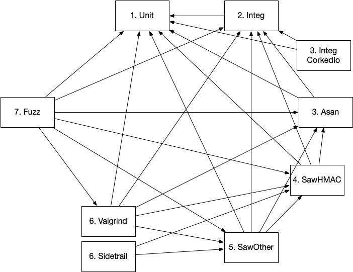

### CodeBuild script info

#### Design

- How does CodeBuild decide what to install/test ?
   To match with Travis and minimize rewriting, the environment variables passed to the job
   dictate what is installed and which tests get run.  In the case where GitHub Actions starts the 
   job, the environment variables of the CodeBuild job are over-ridden.
- Why not build docker images with the dependencies layered in ?
  This is the end goal: get tests running in CodeBuild first, then optimize the containers where it makes sense.

#### Dep tree

General flow of the CodeBuild Test Projects

- buildspec_{OS}.yml
    - codebuild/install_default_dependencies.sh
        - codebuild/install_clang.sh
        - codebuild/install_libFuzzer.sh
        - codebuild/install_openssl_1_1_1.sh
        - codebuild/install_openssl_1_0_2.sh
        - codebuild/install_openssl_1_0_2_fips.sh
        - codebuild/install_cppcheck.sh
        - codebuild/install_libressl.sh
        - codebuild/install_python.sh
        - codebuild/install_gnutls.sh
        - codebuild/install_saw.sh
        - codebuild/install_z3_yices.sh
        - codebuild/install_sslyze.sh
    - codebuild/s2n_codebuild.sh
        - codebuild/s2n_override_paths.sh
        - codebuild/run_cppcheck.sh
        - codebuild/copyright_mistake_scanner.sh
        - codebuild/run_kwstyle.sh
        - codebuild/cpp_style_comment_linter.sh
        - codebuild/run_ctverif.sh
        - codebuild/run_sidetrail.sh
        - codebuild/grep_simple_mistakes.sh
    - codebuild/s2n_after_codebuild.sh
        - curl -s https://codecov.io/bash


### GitHub Actions comments

For the full details see [aws-actions/aws-codebuild-run-build](https://github.com/aws-actions/aws-codebuild-run-build) . The `.github/workflows/*.yml` control
 the how jobs are launched.  Due to throttling, for the first iteration the various steps have dependencies placed on them, 
 graphed below.  The number preceeding the test is the dependency order and the arrowed lines point to steps that need to be completed
 before that step can start.

 

### Usage to setup Projects

To bootstrap the CodeBuild jobs, the python script:
```
./create_project --dry-run
```

- Use CloudFormation to create the stack with the generated template.
- Open the CodeBuild projects in the console and setup the Source correctly, using your OTP credentials to connect to Github

### Notes on moving from Travis-ci

- Install_clang from Travis is using google chromium clang commit from 2017- which requires python2.7 (EOL); updated for CodeBuild.
- CodeBuild's environment is more restrictive than Travis- these jobs require elevated privilege to function.
- Warning message from the fuzzer about test speed appear in CodeBuild output, but not in Travis-CI with the same test (See comments on AWS forums about a difference in ANSI TERM support); this also affects colorized output.
- macOS/OSX platform files were not copied because CodeBuild does not support macOS builds.
