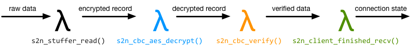
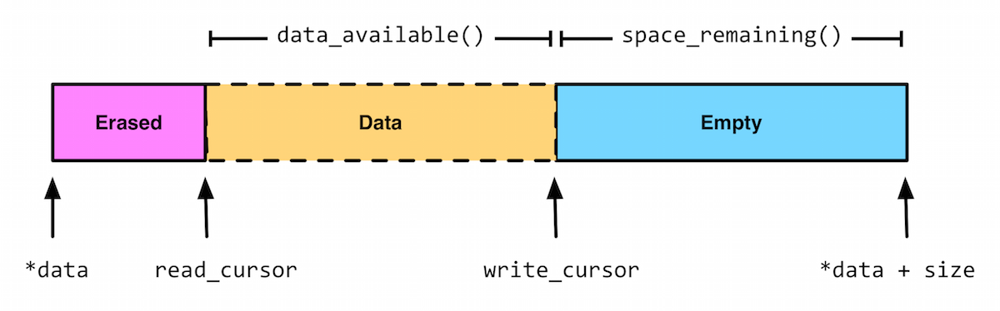

# Development guide for s2n

If you're curious about the internals of s2n, or interested in contributing to
s2n, this document is for you. If you're interested in using s2n in an application
that you're writing, see the accompanying [Usage Guide](https://github.com/awslabs/s2n/blob/master/docs/USAGE-GUIDE.md) instead.

## s2n's tenets

Before getting into the detail of how s2n works internally, it's worth covering
s2n's tenets, as they guide and inform many of the design decisions we'll go through. 
We're always open to considering new tenets, if you can think of better ones and make 
a case for them. 

### Tenets 
* **Maintain an excellent TLS/SSL implementation** Although it's hidden "*under the hood*", TLS/SSL is the direct interface with customers and end-users. Good performance and security are critical to a positive experience.
* **Protect user data and keys** Above all else, s2n must ensure that user data and private keys are being handled correctly and carefully. Security is often a matter of trade-offs and costs; we should always seek to increase the costs for attackers whenever the trade offs are acceptable to users.
* **Stay minimal and simple** Write as little code as neccessary, omit little-used optional features and support as few modes of operation as possible.
* **Write clear readable code with a light cognitive load** s2n's code should be consise, easy to follow and legible to a proficient C programmer. Our code should be organized in a way that divides the implementation up into small units of work, with all of the context neccessary at hand. We should also minimize the number of branches in our code, the depth of our call stacks, and the membership of our structures.   
* **Defend in depth and systematically** Great care and attention to detail is required to write good code, but we should also use automation and mechanistic processess to protect against human error. We should fix bugs (of course), but also fix classes of bugs.
* **Be easy to use and maintain sane defaults** It should be low effort, even for a novice developer, to use s2n in a safe way. We also shouldn't "*pass the buck*" and place the burden of subtle or complicated TLS-specific decision making on application authors or system administrators. 
* **Provide great performance and responsivity** TLS/SSL is rapidly becoming ubiquitious, in part due to advances in performance and responsivity. Naturally, people always appreciate speed, but costs are also important. Even small inefficiencies and overhead in s2n can become significant when multiplied by billions of users and quintillions of sessions. 
* **Stay humble and stick to facts** s2n operates in a security critical space. Even with the most precautionary development methods it is impossible to guarantee the absence of defects. A subtle one-byte error on a single line may still cause problems. Boasting about security practices is destined to backfire and mis-lead. As opinions can differ on security best practises, sometimes in contradictory ways, we should be guided by facts and measurable data.   

When weighing up difficult implementation trade-offs our ordered priorities are: 1. Security, 2. Readability 3. Ease of use, and 4. Performance. 

## Coding style and conventions 

Per our tenets, an important goal is to reduce the cognitive load required to 
read, review and extend s2n. Although s2n is written in C, s2n adopts several
patterns more common to functional programming, though they are used in a way
that is idiomatic and shouldn't feel completely alien in C. 

### High level function design
The first convention is that's s2n's functions are generally quite small, no
more than a page or two at most and commonly just a few lines. They usually 
have a clear input and output and are in that sense "pure" functions; for 
example handling a particular TLS handshake message type takes the message
as input, and the output is connection state. 

In a very technical sense, the functions are not actually 
pure, as they operate on the members of structs that are passed rather than
treating parameters as immutable, but it would be laborious and less readable
in C to support multi-member return structures. What's more relevant is that
s2n functions generally operate in a message passing way. For example,
a simplified version of the flow when handling a TLS client finished message
might looks like this:

each function handles a clear, well-defined piece of work, before passing on
responsibility to the next function. 

The second convention of s2n's functions is that functions are generally
split into two kinds: those that handle control flow and coordinate
other functions, and those that parse messages. In the above diagram,
for the most part the functions are calling each other directly. Instead
there's usually a common parent function that's handling the calling and
message routing. 

Splitting things up this way leads to a shallower call stack, but the main 
benefit is that functions can read quite declaratively. In the case of message
parsers, the function contents can read almost like schemas of the message 
being passed. s2n is also structured in a very message oriented way; for 
example the functions for reading and writing a particular message type 
are usually in the same file, so that all of context and logic needed to 
handle that message type can be seen and thought about in one neat place. 

A good example file for message parsing to look at is [tls/s2n_server_finished.c](https://github.com/awslabs/s2n/blob/master/tls/s2n_server_finished.c). 
From reading the file it should be reasonably clear that a server
finished message consists just of S2N_TLS_FINISHED_LEN number of bytes, what 
the next state is and what else is going on. 

### Error handling and Macros

As may be clear from s2n_server_finished.c, s2n has some conventions for how errors are handled. First up: s2n functions should always return -1 or NULL on error, and 0 or a valid pointer on success. s2n also includes a thread local variable: s2n_errno, for indicating the cause of the error. This is somewhat ugly and unfortunate, but it follows the convention set by libc (with errno), getaddrinfo (gai_errno), net-snmp (snmp_errno), and countless other libraries. In short; in C it is the pattern of least surprise. 

In s2n, we **always** check return values. Because the coding pattern:

    if (s2n_do_something(with_something_else) < 0) {
        return -1;
    }
is so common, utils/s2n_safety.h provides two macros:

    #define GUARD( x )      if ( (x) < 0 ) return -1
    #define GUARD_PTR( x )  if ( (x) < 0 ) return NULL

These macros should be used when calling functions you expect to succeed. Primarily these macros help save two lines that repeatedly clutter files, and secondarily they are very useful when developing and debugging code as it is easy to redefine the macro to implement a simple backtrace (even a dumb printf will suffice, but a breakpoint is more usual). 

If cases where a condition could fail (where a protocol error occurs, for example) an S2N_ERROR() macro is provided for surfacing errors to an application. New error translations, and their human-readable translations can be defined in [error/s2n_errno.h](https://github.com/awslabs/s2n/blob/master/error/s2n_errno.h) and [error/s2n_errno.c](https://github.com/awslabs/s2n/blob/master/error/s2n_errno.c). When called, e.g.:

    S2N_ERROR(S2N_ERR_BAD_MESSAGE);

the macro will set s2n_errno correctly, as well as some useful debug strings, and return -1. 

### Safety checking

[utils/s2n_safety.h](https://github.com/awslabs/s2n/blob/master/utils/s2n_safety.h) provides several more convenience macros intended to make safety and bounds checking easier. There are checked versions of memcpy and memset, as well as predicate testers like gte_check, inclusive_range_check, exclusive_range_check for performing simple comparisons in a systematic, error-handled, way. 

*Note*: In general, C preprocessor Macros with embedded control flow are a bad idea, but GUARD, S2N_ERROR and the safety checkers are so thoroughly used throughout s2n that it should be a clear and idiomatic pattern, almost forming a small domain specific language of sorts. 

### Control flow and the state machine

Branches can be a source of cognitive load, as they ask the reader to follow a path of thinking, while always remembering that there is another to be explored. Additionally when branches are nested they can often lead to impossible to grasp combinatorial explosions. s2n tries to systematically reduce the number of branches used in the code in several ways. 

Firstly, there are almost no ifdef calls in s2n. Ifdefs can be a particularly penalising source of cognitive load. In addition to being a branch, they also ask the reader to mix state from two different languages (C, and the C pre processor) and they tend to be associated with ugly rendering in IDEs and code formatters. In the few places where ifdef's are neccessary, we use them in a careful way without compromising the integrity of the function. [utils/s2n_timer.c](https://github.com/awslabs/s2n/blob/master/utils/s2n_timer.c) is a good example. Rather than mixing the Apple and non-Apple implementations and cluttering one function with several ifdefs, there is a complete implementation of the timer functionality for each platform. Within the POSIX implementation, an ifdef and define are used to use the most precise clock type, but in a way that does not compromise readability. 

Secondly, s2n generally branches in the case of failure, rather than success. So instead of creating a nest of if's:

    if (s2n_foo() == 0) {
        if (s2n_bar() == 0) {
             if (s2n_baz() == 0) {

we do:

    GUARD(s2n_foo());
    GUARD(s2n_bar());
    GUARD(s2n_baz));

This pattern leads to a linear control flow, where the main body of a function describes everything that happens in a regular, "*happy*" case. Any deviation is usually a fatal error and we exit the function. This is safe because s2n rarely allocates resources, and so has nothing to clean up on error. 

This pattern also leads to extremely few "else" clauses in the s2n code base. Within s2n, else clauses should be treated with suspicion and examined for potential eradication. Where an else clause is neccessary, we try to ensure that the first if block is the most likely case. Both to aid readability, and also for a more efficient compiled instruction pipeline (although good CPU branch prediction will rapidly correct any mis-ordering). 

For branches on small enumerated types, s2n generally favours switch statements: though switch statements taking up more than about 25 lines of code are discouraged, and a "default:" block is mandatory. 

Another technique for complexity avoidance is that the core TLS state machine within s2n does not use branches and instead uses a table of function pointers (another technique borrowed from functional programming) to dispatch data to the correct handler. This is covered in more detail later in this document. 

Lastly, s2n studiously avoids locks. s2n is designed to be thread-safe, but does so by using atomic data types in the small number of well-isolated variables that may be accessed by multiple threads. 

### Code formatting and commenting 

s2n is written in C99. The code formatting and indentation should be relatively clear from reading some s2n source files, but there is also an automated "make indent" target that will indent the s2n sources. 

There should be no need for comments to explain *what* s2n code is doing; variables and functions should be given clear and human-readable names that makes their purpose and intent intuitive. Comments explaining *why* we are doing something are encouraged. Often some context setting is neccessary; a reference to an RFC, or a reminder of some critical state that is hard to work directly into the immediate code in a natural way. 

Every source code file must include a copy of the Apache Software License 2.0, as well as a correct copyright notification. The year of copyright should be the year in which the file was first created. 

There is also a brief set of other coding conventions:

* s2n uses explicitly sized primitives where possible. E.g. uint8_t, uint32_t. 
* In general s2n uses unsigned ints for sizes, as TLS/SSL do the same.
* Any structures exposed to application authors must be opaque: s2n manages the memory allocation and de-allocation.
* Variables are declared closest to their first point of use, to maximize context around the typing. 
* Duplication of logic is discouraged
* 4 spaces, no tabs
* Assuming a terminal that is 120 characters wide is ok

## Tests 

s2n is written in C99, a language which lacks a "standard" testing framework. Although there are some more well used C++ testing frameworks, s2n also targets some embedded platforms on which a C++ compiler is unavailable. 

Since testing and test-cases are absolutely mandatory for all s2n functionality, s2n includes its own small testing framework, defined in [tests/s2n_test.h](https://github.com/awslabs/s2n/blob/master/tests/s2n_test.h). The framework consists of 15 macros that allow you to start a test suite, which is a normal C application with a main() function, and to validation various expectations. 

Unit tests are added as .c files in [tests/unit/](https://github.com/awslabs/s2n/blob/master/tests/unit/). A simple example to look at is [tests/unit/s2n_stuffer_base64_test.c](https://github.com/awslabs/s2n/blob/master/tests/unit/s2n_stuffer_base64_test.c). The tests are started with BEGIN_TEST(), and expectations are tested with EXPECT_SUCCESS and EXPECT_EQUAL before exiting with an END_TEST call. 

The test framework will take care of compiling and executing the tests and even indicates success or failure with motivating green or red text in the console.

In addition to fully covering functionality in the correct cases, s2n tests are also expected to include adversarial or "negative" test cases. For example the tests performed on record encryption validate that s2n is tamper resistent by attempting to actually tamper with records. Similarly, we validate that our memory handling routines cannot be over-filled by attempting to over-fill them. 

To avoid adding unneeded code to the production build of s2n, there is also a small test library defined at [tests/testlib/](https://github.com/awslabs/s2n/blob/master/tests/testlib/) which includes routines useful for test cases. For example there is a hex parser and emitter, which is useful for defining network data in test cases, but not needed in production.

## A tour of s2n memory handling: blobs and stuffers

C has a notorious history of issues around memory and buffer handling. To try and avoid problems in this area, s2n does not use C string functions or standard buffer manipulation patterns. Instead memory regions are tracked explicitly, with s2n_blob structures, and buffers are re-oriented as streams with s2n_stuffer structures.

### s2n_blob : keeping track of memory ranges

s2n_blob's are a very simple data structure:

    struct s2n_blob {
        uint8_t *data;
        uint32_t size;
    };

functions which handle memory ranges are expected to at least use blobs (stuffers are better though, as we'll see). A blob can be initialized with an existing memory buffer using s2n_blob_init, but  [utils/s2n_mem.h](https://github.com/awslabs/s2n/blob/master/utils/s2n_mem.h) also defines routines for dynamically allocated blobs. For handling user data we prefer the latter, as s2n prevents the memory regions from being swapped to disk and from showing up in core files (where supported). 

### s2n_stuffer : a streaming buffer for stuff

The stuffer data structure included in s2n is intended to handle all protocol level
input and output to memory buffers and is the real work-horse of s2n. At its core
a stuffer is a blob and two cursors:

     struct s2n_stuffer {
        struct s2n_blob blob;
        uint32_t read_cursor;
        uint32_t write_cursor;
        ...
     };

This creates a layout that makes it possible to implement a stream:

In addition to basic size and overflow
management, a stuffer can also perform serialisation and de-serialisation for
commonly used types and encodings.

Data can be written to a stuffer and this will increment the write cursor.
Internally, the stuffer routines ensure that no more data can be written to the
stuffer than there is space available. Data can be read from the stuffer, and
this increments the read cursor. Attempts to read data beyond the write cursor
will fail.

There are also three types of stuffer: static stuffers which are backed by
memory provided by the caller (usually a static buffer, allocated on the
stack), alloced stuffers which are backed by realloc() but fixed in size and
growable stuffers, which are backed by realloc() but may also grow in size to
meet demand and can be resized using s2n_stuffer_resize().

Static buffers are initialized with s2n_stuffer_init(), alloced stuffers with
s2n_stuffer_alloc() and growable stuffers with s2n_stuffer_growable_alloc().
One initialized or allocated, stuffers also have a repeating life-cycle, with
calls to s2n_stuffer_wipe() providing the re-incarnation and resetting the
stuffer to its initial state (and wiping the contents).

For performance reasons it is sometimes nesseccary to operate directly on the
contents of a stuffer. s2n_stuffer_raw_read() and s2n_stuffer_raw_write() are
provided for this, s2n_stuffer_raw_read() should be called when data is being
read directly, s2n_stuffer_raw_write() should be called when data is being
inserted directly. Boundary and overflow checking will still be performed.

Both of these functions return pointers. To ensure that these pointers remain
valid, these functions both mark a stuffer as tainted. A tainted stuffer cannot
be grown or resized, to prevent any underlying call to realloc() from
invalidating the pointers. s2n_stuffer_wipe() will reset the tainted state, so
any pointers saved can not used once this has been called.

## s2n_connection : the core data for a connection

## How s2n handles the tls state machine

