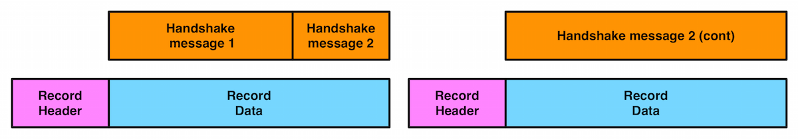

# Development guide for s2n

If you are curious about the internals of s2n, or interested in contributing to
s2n, this document is for you. If instead you are interested in using s2n in an application
that you are developing, please see the accompanying [Usage Guide](https://github.com/awslabs/s2n/blob/master/docs/USAGE-GUIDE.md).

## s2n's development principles

Before getting into the detail of how s2n works internally, it's worth covering
s2n's development principles. These principles guide and inform many of the design 
decisions we'll go through. We're always open to new principles, if you can think of 
better ones and make a case for them. 

#### Development principles 
* **Maintain an excellent TLS/SSL implementation**<br/>Although it's hidden "*under the hood*", TLS/SSL is the direct interface with customers and end-users. Good performance and security are critical to a positive experience.
* **Protect user data and keys**<br/>Above all else, s2n must ensure that user data and private keys are being handled correctly and carefully. Security is often a matter of trade-offs and costs; we should always strive to increase the costs for attackers whenever the trade offs are acceptable to users.
* **Stay simple**<br/>Write as little code as necessary, omit rarely used optional features and support as few modes of operation as possible. We will also promote and encourage changes that reduce the size of our code base.
* **Write clear readable code with a light cognitive load**<br/>s2n's code must be concise, easy to follow and legible to a proficient C programmer. Our code should be organized in a way that divides the implementation up into small units of work, with the entire context necessary at hand. We should also minimize the number of branches in our code, the depth of our call stacks, and the number of members in our structures.   
* **Defend in depth and systematically**<br/>Great care and attention to detail is required to write good code, but we also use automation and mechanistic processes to protect against human error. 
* **Be easy to use and maintain sane defaults**<br/>It should be low effort, even for a novice developer, to use s2n in a safe way. We also shouldn't "*pass the buck*" and place the burden of subtle or complicated TLS-specific decision making upon application authors and system administrators. 
* **Provide great performance and responsiveness**<br/>TLS/SSL is rapidly becoming ubiquitous. Even small inefficiencies and overhead can become significant when multiplied by billions of users and quintillions of sessions. 
* **Stay paranoid**<br/>s2n operates in a security critical space. Even with the most precautionary development methods it is impossible to guarantee the absence of defects. A subtle one-byte error on a single line may still cause problems. 
* **Make data-driven decisions**<br/>Opinions can differ on security best practices, sometimes in contradictory ways. Where possible, we are guided by facts and measurable data.   

#### Priorities

When weighing up difficult implementation trade-offs our ordered set of priorities are: 

1. Security
2. Readability
3. Ease of use
4. Performance. 

#### Commit and code-review policy

s2n is review-then-commit for code changes, and commit-then-review for
documentation changes. Code additions are made by pull requests, no author may
merge their own pull request on code. Changes to documentation, including code
comments, may be made more freely.

## Coding style and conventions 

Per our development principles, an important goal is to reduce the cognitive load required to 
read, review and extend s2n. Although s2n is written in C, s2n adopts several
patterns more common to functional programming. Though they are used in a way
that is idiomatic and shouldn't feel completely alien in C. 

### High level function design
The first convention is that's s2n's functions are generally quite small, no
more than a page or two at most and commonly just a few lines. Functions 
have a clear input and output and are in that sense "pure" functions; for 
example handling a particular TLS handshake message type takes the message
as input, and the output is connection state. 

```c
/* An idiomatic s2n function generally has:
 * 
 *  An int return value. This is used to signal success or error.
 *  An input, often a struct.
 *  An output, often a struct.
 */
int s2n_do_something(struct *some_input, struct *some_output);
```

s2n functions also operate in a message passing style. For example,
a simplified version of the flow when handling a TLS client finished message
might looks like this:


each function handles a clear, well-defined piece of work, before passing on
responsibility to the next function. 

The second convention of s2n's functions is that functions are
split into two kinds: those that handle control flow and coordinate
other functions, and those that parse messages. For example, in the above 
diagram, it might appear that the functions are calling each other directly
but we try to avoid that. Instead there is a coordinating outer function
responsible for the flow control. 

A simplified version of the coordinating function would resemble:

```c
GUARD(s2n_stuffer_read(connection, input_stuffer));
GUARD(s2n_cbc_aes_decrypt(input_stuffer, output_stuffer));
GUARD(s2n_cbc_verify(output_stuffer));
```

Splitting things up this way leads to a shallower call stack, but the main 
benefit is that functions can read quite declaratively. In the case of message
parsers, the function contents can read almost like schemas of the message 
being parsed. 

A good example file for message parsing to look at is [tls/s2n_server_finished.c](https://github.com/awslabs/s2n/blob/master/tls/s2n_server_finished.c). 
From reading the file it should be reasonably clear that a server
finished message consists just of S2N_TLS_FINISHED_LEN number of bytes, what 
the next state is and so on.

As you may also see in that file, the functions for reading and writing a 
particular message type are in the same file. That way all of context and 
logic needed to handle that message type can be reviewed and thought about in 
one place. 

### Error handling and Macros

As may also be clear from the above examples, s2n has some conventions for how errors are handled. Firstly, s2n functions should always return -1 or NULL on error, and 0 or a valid pointer on success. s2n also includes a thread local variable: s2n_errno, for indicating the cause of the error. This follows the convention set by libc (with errno), getaddrinfo (gai_errno), net-snmp (snmp_errno), and countless other libraries. 

In s2n, we **always** check return values. Because of that, the coding pattern:

```c
if (s2n_do_something(with_something_else) < 0) {
    return -1;
}
```

is so common that utils/s2n_safety.h provides two macros:

```c
#define GUARD( x )      if ( (x) < 0 ) return -1
#define GUARD_PTR( x )  if ( (x) < 0 ) return NULL
```

These macros should be used when calling functions you expect to succeed. Primarily these macros help save two lines that repeatedly clutter files, and secondarily they are very useful when developing and debugging code as it is easy to redefine the macro to implement a simple backtrace (even a simple printf will suffice, but a breakpoint is more usual). 

If a function does fail, it should use the S2N_ERROR() macro provided for surfacing the error to an application. 
New error translations, and their human-readable translations can be defined in [error/s2n_errno.h](https://github.com/awslabs/s2n/blob/master/error/s2n_errno.h) and [error/s2n_errno.c](https://github.com/awslabs/s2n/blob/master/error/s2n_errno.c). When called, e.g.:

```c
S2N_ERROR(S2N_ERR_BAD_MESSAGE);
```

the macro will set s2n_errno correctly, as well as some useful debug strings, and return -1. 

### Safety checking

[utils/s2n_safety.h](https://github.com/awslabs/s2n/blob/master/utils/s2n_safety.h) provides several more convenience macros intended to make safety and bounds checking easier. There are checked versions of memcpy and memset, as well as predicate testers like gte_check, inclusive_range_check, exclusive_range_check for performing simple comparisons in a systematic, error-handled, way. 

*Note*: In general, C preprocessor Macros with embedded control flow are a bad idea, but GUARD, S2N_ERROR and the safety checkers are so thoroughly used throughout s2n that it should be a clear and idiomatic pattern, almost forming a small domain specific language. 

### Cleanup On Error
As discussed below, s2n rarely allocates resources, and so has nothing to clean up on error.  For cases where functions do allocate resources which must be cleaned up, s2n offers two macros:

```c
#define GUARD_GOTO( x , label ) if ( (x) < 0 ) goto label
#define DEFER_CLEANUP(_thealloc, _thecleanup)  __attribute__((cleanup(_thecleanup))) _thealloc
```

`GUARD_GOTO( x , label )` does traditional "goto" style cleanup: if the function `x` returns an error, control is transfered to label `label`.  It is the responsibility of the code at `label` to cleanup any resources, and then return `-1`.

`DEFER_CLEANUP(_thealloc, _thecleanup)` is a more failsafe way of ensuring that resources are cleaned up, using the ` __attribute__((cleanup())` destructor mechanism available in modern C compilers.  When the variable declared in `_thealloc` goes out of scope, the cleanup function `_thecleanup` is automatically called.  This guarantees that resources will be cleaned up, no matter how the function exits.

### Control flow and the state machine

Branches can be a source of cognitive load, as they ask the reader to follow a path of thinking, while also remembering that there is another path to be explored. When branches are nested they can often lead to impossible to grasp combinatorial explosions. s2n tries to systematically reduce the number of branches used in the code in several ways. 

Firstly, there are almost no ifdef calls in s2n. Ifdefs can be a particularly penalizing source of cognitive load. In addition to being a branch, they also ask the reader to mix state from two different languages (C, and the C pre processor) and they tend to be associated with ugly rendering in IDEs and code formatters. In the few places where ifdef's are necessary, we use them in a careful way without compromising the integrity of the function. [tls/s2n_config.c](https://github.com/awslabs/s2n/blob/master/tls/s2n_config.c) is a good example. Rather than mixing the Apple and non-Apple implementations and cluttering one function with several ifdefs, there is a complete implementation of the timer functionality for each platform. Within the POSIX implementation, an ifdef and define are used to use the most precise clock type, but in a way that does not compromise readability. 

Secondly, s2n generally branches in the case of failure, rather than success. So instead of creating a nest of if's:

```c
if (s2n_foo() == 0) {
    if (s2n_bar() == 0) {
         if (s2n_baz() == 0) {
```

we do:

```c
GUARD(s2n_foo());
GUARD(s2n_bar());
GUARD(s2n_baz());
```

This pattern leads to a linear control flow, where the main body of a function describes everything that happens in a regular, "*happy*" case. Any deviation is usually a fatal error and we exit the function. This is safe because s2n rarely allocates resources, and so has nothing to clean up on error. 

This pattern also leads to extremely few "else" clauses in the s2n code base. Within s2n, else clauses should be treated with suspicion and examined for potential eradication. Where an else clause is necessary, we try to ensure that the first if block is the most likely case. This aids readability, and also results in a more efficient compiled instruction pipeline (although good CPU branch prediction will rapidly correct any mis-ordering). 

For branches on small enumerated types, s2n generally favors switch statements: though switch statements taking up more than about 25 lines of code are discouraged, and a "default:" block is mandatory. 

Another technique for complexity avoidance is that the core TLS state machine within s2n does not use branches and instead uses a table of function pointers (another technique borrowed from functional programming) to dispatch data to the correct handler. This is covered in more detail later in this document. 

Lastly, s2n studiously avoids locks. s2n is designed to be thread-safe, but does so by using atomic data types in the small number of well-isolated variables that may be accessed by multiple threads. 

### Code formatting and commenting 

s2n is written in C99. The code formatting and indentation should be relatively clear from reading some s2n source files, but there is also an automated "make indent" target that will indent the s2n sources. 

There should be no need for comments to explain *what* s2n code is doing; variables and functions should be given clear and human-readable names that make their purpose and intent intuitive. Comments explaining *why* we are doing something are encouraged. Often some context setting is necessary; a reference to an RFC, or a reminder of some critical state that is hard to work directly into the immediate code in a natural way. All comments should be written using C syntax `/* */` and **avoid** C++ comments `//` even though C99 compilers allow `//`. 

Every source code file must include a copy of the Apache Software License 2.0, as well as a correct copyright notification. The year of copyright should be the year in which the file was first created. 

There is also a brief set of other coding conventions:

* s2n uses explicitly sized primitives where possible. E.g. uint8_t, uint32_t. 
* In general s2n uses unsigned ints for sizes, as TLS/SSL do the same.
* Any structures exposed to application authors must be opaque: s2n manages the memory allocation and de-allocation.
* Variables are declared closest to their first point of use, to maximize context around the typing. 
* Duplication of logic is discouraged
* 4 spaces, no tabs
* Assuming a terminal that is 120 characters wide is ok

## Tests 

s2n is written in C99, a language which lacks a "standard" testing framework. Although there are some more well used C++ testing frameworks, s2n also targets some embedded platforms on which a C++ compiler is unavailable. 

Since testing and test-cases are absolutely mandatory for all s2n functionality, s2n includes its own small testing framework, defined in [tests/s2n_test.h](https://github.com/awslabs/s2n/blob/master/tests/s2n_test.h). The framework consists of 15 macros that allow you to start a test suite, which is a normal C application with a main() function, and to validate various expectations. 

Unit tests are added as .c files in [tests/unit/](https://github.com/awslabs/s2n/blob/master/tests/unit/). A simple example to look at is [tests/unit/s2n_stuffer_base64_test.c](https://github.com/awslabs/s2n/blob/master/tests/unit/s2n_stuffer_base64_test.c). The tests are started with BEGIN_TEST(), and expectations are tested with EXPECT_SUCCESS and EXPECT_EQUAL before exiting with an END_TEST call. 

The test framework will take care of compiling and executing the tests and indicates success or failure with green or red text in the console.

In addition to fully covering functionality in the correct cases, s2n tests are also expected to include adversarial or "negative" test cases. For example the tests performed on record encryption validate that s2n is tamper resistant by attempting to actually tamper with records. Similarly, we validate that our memory handling routines cannot be over-filled by attempting to over-fill them. 

To avoid adding unneeded code to the production build of s2n, there is also a small test library defined at [tests/testlib/](https://github.com/awslabs/s2n/blob/master/tests/testlib/) which includes routines useful for test cases. For example there is a hex parser and emitter, which is useful for defining network data in test cases, but not needed in production.

Unit tests are run automatically with `make`. To run a subset of the unit tests, set the `UNIT_TESTS` environment variable with the unit test name(s). For example:
```
UNIT_TESTS=s2n_hash_test make
```

## A tour of s2n memory handling: blobs and stuffers

C has a history of issues around memory and buffer handling. To avoid problems in this area, s2n does not use C string functions or standard buffer manipulation patterns. Instead memory regions are tracked explicitly, with `s2n_blob` structures, and buffers are re-oriented as streams with `s2n_stuffer` structures.

### s2n_blob : keeping track of memory ranges

`s2n_blob` is a very simple data structure:

```c
struct s2n_blob {
    uint8_t *data;
    uint32_t size;
};
```

Functions that handle memory ranges are expected to at least use blobs (stuffers are better though, as we'll see). A blob can be initialized with an existing memory buffer using **s2n_blob_init**, but  [utils/s2n_mem.h](https://github.com/awslabs/s2n/blob/master/utils/s2n_mem.h) also defines routines for dynamically allocated blobs. For handling user data we prefer the latter, as s2n prevents the memory regions from being swapped to disk and from showing up in core files (where supported). 

### s2n_stuffer : a streaming buffer

The stuffer data structure included in s2n is intended to handle all protocol level
input and output to memory buffers and is the real work-horse of s2n. At its core
a stuffer is a blob and two cursors:

```c
struct s2n_stuffer {
    struct s2n_blob blob;
    uint32_t read_cursor;
    uint32_t write_cursor;
    ...
};
```

This layout that makes it possible to implement a stream:


All access to/from the stuffer goes "through" s2n_stuffer_ functions. For example, we can write with **s2n_stuffer_write()**, and when we do the write cursor is incremented to the new position. We can read with **s2n_stuffer_read()**, and of course we can only read data as far as the write cursor (which is always at or ahead of the read cursor). To protect user data, when we read data out of the stuffer, we wipe the copy of the data within the local stuffer memory. We also ensure that it's only possible to read as much data as is in the stuffer. 

A stuffer can be initialized directly from a blob, which makes it fixed in size, or it can be allocated dynamically. In the latter case, we can also choose to make the stuffer growable (by using **s2n_stuffer_growable_alloc** instead of **s2n_stuffer_alloc**). If a stuffer is growable then attempting to write past the end of the current blob will result in the blob being extended (by at least 1K at a time) to fit the data. 

To further encourage stream-oriented programming, the stuffer is also the place where all marshaling and de-marshaling happens. For example you can read and write ints directly to a stuffer:

```c
/* Read and write integers in network order */
extern int s2n_stuffer_read_uint8(struct s2n_stuffer *stuffer, uint8_t *u);
extern int s2n_stuffer_read_uint16(struct s2n_stuffer *stuffer, uint16_t *u);
extern int s2n_stuffer_read_uint24(struct s2n_stuffer *stuffer, uint32_t *u);
extern int s2n_stuffer_read_uint32(struct s2n_stuffer *stuffer, uint32_t *u);
extern int s2n_stuffer_read_uint64(struct s2n_stuffer *stuffer, uint64_t *u);
extern int s2n_stuffer_write_uint8(struct s2n_stuffer *stuffer, uint8_t u);
extern int s2n_stuffer_write_uint16(struct s2n_stuffer *stuffer, uint16_t u);
extern int s2n_stuffer_write_uint24(struct s2n_stuffer *stuffer, uint32_t u);
extern int s2n_stuffer_write_uint32(struct s2n_stuffer *stuffer, uint32_t u);
extern int s2n_stuffer_write_uint64(struct s2n_stuffer *stuffer, uint64_t u);
```

and there are other utility functions for handling base64 encoding to and from a stuffer, or text manipulation - like tokenization. The idea is to implement basic serializing just once, rather than spread out and duplicated across the message parsers, and to maximize the declarative nature of the I/O. For example, this code parses a TLS record header:

```c
GUARD(s2n_stuffer_read_uint8(in, &message_type));
GUARD(s2n_stuffer_read_uint8(in, &protocol_major_version));
GUARD(s2n_stuffer_read_uint8(in, &protocol_minor_version));
GUARD(s2n_stuffer_read_uint16(in, &record_size));
```
    
This pattern should make it very clear what the message format is, where the contents are being stored, and that we're handling things in a safe way.

There are times when we must interact with C functions from other libraries; for example when handling encryption and decryption. In these cases it is usually necessary to provide access to "raw" pointers into stuffers. s2n provides two functions for this:

```c
void *s2n_stuffer_raw_write(struct s2n_stuffer *stuffer, uint32_t data_len);
void *s2n_stuffer_raw_read(struct s2n_stuffer *stuffer, uint32_t data_len);
```

the first function returns a pointer to the existing location of the write cursor, and then increments the write cursor by `data_len`, so an external function is free to write to the pointer, as long as it only writes `data_len` bytes.
The second function does the same thing, except that it increments the read cursor.
Use of these functions is discouraged and should only be done when necessary for compatibility.

One problem with returning raw pointers is that a pointer can become stale if the stuffer is later resized. Growable stuffers are resized using realloc(), which is free to copy and re-address memory. This could leave the original pointer location dangling, potentially leading to an invalid access. To prevent this, stuffers have a life-cycle and can be tainted, which prevents them from being resized within their present life-cycle. 

Internally stuffers track 4 pieces of state:

```c
uint32_t     high_water_mark;
unsigned int alloced:1;
unsigned int growable:1;
unsigned int tainted:1;
```

The `high_water_mark` tracks the furthermost byte which has been written but not yet wiped.
Note that this may be past the `write_cursor` if `s2n_stuffer_rewrite()` has been called.
Explicitly tracking the `high_water_mark` allows us to track the bytes which need to be wiped, and helps avoids needless zeroing of memory.
The next two bits of state track whether a stuffer was dynamically allocated (and so should be free'd later) and whether or not it is growable.
`tainted` is set to 1 whenever the raw access functions are called.
If a stuffer is currently tainted then it can not be resized and it becomes ungrowable.
This is reset when a stuffer is explicitly wiped, which begins the life-cycle anew.
So any pointers returned by the raw access functions are legal only until `s2n_stuffer_wipe()` is called.
The end result is that this kind of pattern is legal:

```c
GUARD(s2n_stuffer_growable_alloc(&in, 1500));
GUARD(s2n_stuffer_write(&in, &fifteen_hundred_bytes_blob));
uint8_t * ptr = s2n_stuffer_raw_read(&in, 1500);
```

but attempting to write more data would not be legal:

```c
GUARD(s2n_stuffer_growable_alloc(&in, 1500));
GUARD(s2n_stuffer_write(&in, &fifteen_hundred_bytes_blob));
uint8_t * ptr = s2n_stuffer_raw_read(&in, 1500);
     
/* This write will fail, the stuffer is no longer growable, as a raw
 * pointer was taken */
GUARD(s2n_stuffer_write(&in, &some_more_data_blob);
     
/* Stuffer life cycle is now complete, reset everything and wipe */
GUARD(s2n_stuffer_wipe(&in));
```

## s2n_connection and the TLS state machine

Every connection is associated with an s2n_connection structure. The details of this structure are opaque to applications, but internally it is where all of the TLS state is managed. To make sense of what is going on, it is necessary to understand how the TLS protocol works at the record and handshake layers.

When a TLS connection is being started, the first communication consists of handshake messages. The client sends the first message (a client hello), and then the server replies (with a server hello), and so on. Because a server must wait for a client and vice versa, this phase of a TLS connection is not full-duplex. To save on memory, s2n uses a single stuffer for both incoming and outgoing handshake messages and it is located as s2n_connection->handshake.io (which is a growable stuffer). 

Borrowing another trick from functional programming, the state machine for handling handshake messages is implemented using a table of function pointers, located in [tls/s2n_handshake_io.c](https://github.com/awslabs/s2n/blob/master/tls/s2n_handshake_io.c). 

```c
static struct s2n_handshake_action state_machine[] = {
    /*Message type  Handshake type       Writer S2N_SERVER                S2N_CLIENT                   handshake.state              */
    {TLS_HANDSHAKE, TLS_CLIENT_HELLO,      'C', {s2n_client_hello_recv,    s2n_client_hello_send}},    /* CLIENT_HELLO              */
    {TLS_HANDSHAKE, TLS_SERVER_HELLO,      'S', {s2n_server_hello_send,    s2n_server_hello_recv}},    /* SERVER_HELLO              */
    {TLS_HANDSHAKE, TLS_SERVER_CERT,       'S', {s2n_server_cert_send,     s2n_server_cert_recv}},     /* SERVER_CERT               */
    {TLS_HANDSHAKE, TLS_SERVER_KEY,        'S', {s2n_server_key_send,      s2n_server_key_recv}},      /* SERVER_KEY                */
    {TLS_HANDSHAKE, TLS_SERVER_CERT_REQ,   'S', {NULL,                     NULL}},                     /* SERVER_CERT_REQ           */
    {TLS_HANDSHAKE, TLS_SERVER_HELLO_DONE, 'S', {s2n_server_done_send,     s2n_server_done_recv}},     /* SERVER_HELLO_DONE         */
    {TLS_HANDSHAKE, TLS_CLIENT_CERT,       'C', {NULL,                     NULL}},                     /* CLIENT_CERT               */
    {TLS_HANDSHAKE, TLS_CLIENT_KEY,        'C', {s2n_client_key_recv,      s2n_client_key_send}},      /* CLIENT_KEY                */
    {TLS_HANDSHAKE, TLS_CLIENT_CERT_VERIFY,'C', {NULL,                     NULL}},                     /* CLIENT_CERT_VERIFY        */
    {TLS_CHANGE_CIPHER_SPEC, 0,            'C', {s2n_client_ccs_recv,      s2n_client_ccs_send}},      /* CLIENT_CHANGE_CIPHER_SPEC */
    {TLS_HANDSHAKE, TLS_CLIENT_FINISHED,   'C', {s2n_client_finished_recv, s2n_client_finished_send}}, /* CLIENT_FINISHED           */
    {TLS_CHANGE_CIPHER_SPEC, 0,            'S', {s2n_server_ccs_send,      s2n_server_ccs_recv}},      /* SERVER_CHANGE_CIPHER_SPEC */
    {TLS_HANDSHAKE, TLS_SERVER_FINISHED,   'S', {s2n_server_finished_send, s2n_server_finished_recv}}, /* SERVER_FINISHED           */
    {TLS_APPLICATION_DATA, 0,              'B', {NULL, NULL}}    /* HANDSHAKE_OVER            */
};
```

The 'writer' field indicates whether we expect a Client or a Server to write a particular message type (or 'B' for both in the case of an application data message, but we haven't gotten to that yet). If s2n is acting as a server, then it attempts to read client messages, if it's acting as a client it will try to write it. To perform either operation it calls the relevant function pointer. This way the state machine can be very short and simple: write a handshake message out when we have one pending, and in the other direction read in data until we have a fully-buffered handshake message before then calling the relevant message parsing function. 

One detail we've skipped over so far is that handshake messages are encapsulated by an additional record layer within the TLS protocol. As we've already seen, TLS records are fairly simple: just a 5 byte header indicating the message type (Handshake, application data, and alerts), protocol version, and record size. The remainder of the record is data and may or may not be encrypted. What isn't so simple is that TLS allows 'inner' messages, like Handshake message, to be fragmented across several records, and for a single record to contain multiple messages. 



In the outbound direction, s2n never coalesces multiple messages into a single record, so writing a handshake message is a simple matter of fragmenting the handshake message if necessary and writing the records. In the inbound direction, the small state machine in s2n_handshake_io.c takes care of any fragmentation and coalescing. See [tests/unit/s2n_fragmentation_coalescing_test.c](https://github.com/awslabs/s2n/blob/master/tests/unit/s2n_fragmentation_coalescing_test.c) for our test cases covering the logic too. 

To perform all of this, the s2n_connection structure has a few more internal stuffers:

```c
struct s2n_stuffer header_in;
struct s2n_stuffer in;
struct s2n_stuffer out;
struct s2n_stuffer alert_in;
```

'header_in' is a small 5 byte stuffer, which is used to read in a record header. Once that stuffer is full, and the size of the next record is determined (from that header), inward data is directed to the 'in' stuffer.  The 'out' stuffer is for data that we are writing out; like an encrypted TLS record. 'alert_in' is for any TLS alert message that s2n receives from its peer. s2n treats all alerts as fatal, but we buffer the full alert message so that reason can be logged. 

When past the handshake phase, s2n supports full-duplex I/O. Separate threads or event handlers are free to call s2n_send and s2n_recv on the same connection. Because either a read or a write may cause a connection to be closed, there are two additional stuffers for storing outbound alert messages:

```c
struct s2n_stuffer reader_alert_out;
struct s2n_stuffer writer_alert_out;
```

this pattern means that both the reader thread and writer thread can create pending alert messages without needing any locks. If either the reader or writer generates an alert, it also sets the 'closing' state to 1.

```c
sig_atomic_t closing;
sig_atomic_t closed;
```

'closing' is an atomic, but even if it were not it can only be changed from 0 to 1, so an over-write is harmless. Every time a TLS record is fully-written, s2n_send() checks to see if closing is set to 1. If it is then the reader or writer alert message will be sent (writer takes priority, if both are present) and the connection will be closed. Once the closed is 1, no more I/O may be sent or received on the connection.

## s2n and entropy

s2n provides two deterministic random number generators to every thread. **s2n_get_public_random_data()** should be used to generate any data that is exposed in a public context including nonces, initialization vectors, and randomized timing values. **s2n_get_private_random_data()** should be used for data which must be kept secret. Additionally s2n over-rides libcrypto's entropy generation with **s2n_get_private_random_data()**.

## Contributing to s2n

We are happy to accept contributions to s2n. We suggest the following general procedure:

* Please read all of the documentation available in the s2n "docs/" directory. This development guide along with the usage guide should give a good flavor for what the goals of s2n are and whether they line up with your idea for a contribution
* If you have an idea for a significant contribution, it is worth first cutting an issue and discussing the change. Get feedback on the API design, or what the feature might require, before writing code. 
* If you discover a security critical bug, please report it via http://aws.amazon.com/security/vulnerability-reporting/ and **do not** create a public issue. 
* Create a git fork of the s2n repository and prepare your changes locally within your fork.
* When you're ready, and when all tests are passing, create a pull request to the master awslabs s2n repository.
* All changes to s2n go through code review and legal review. All submissions and contributions are made under the terms of the Apache Software License 2.0. For larger contributions, we may ask you to sign a contributor license agreement.
* s2n undergoes periodic government and commercial security analyses, including code audits and penetration tests. To participate in these analyses, we may ask you to sign a Non Disclosure Agreement. 

