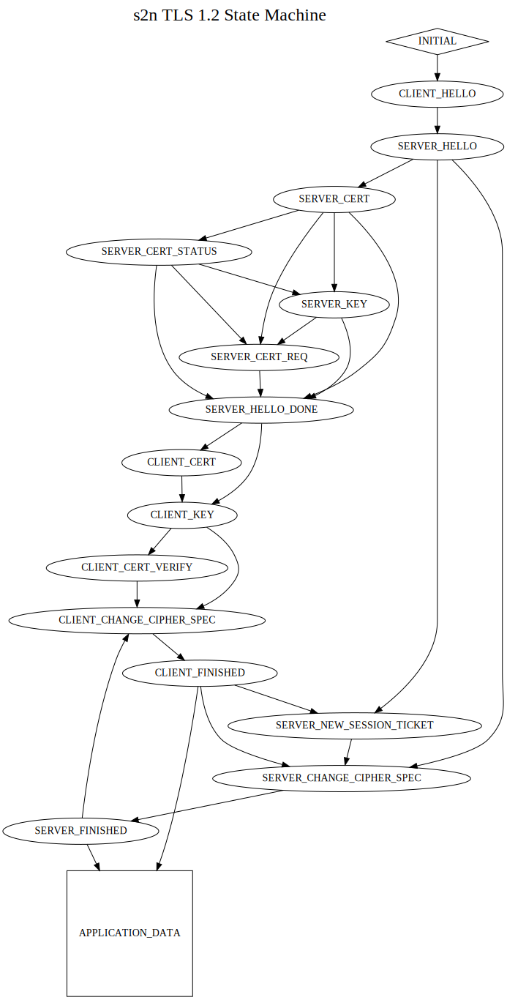
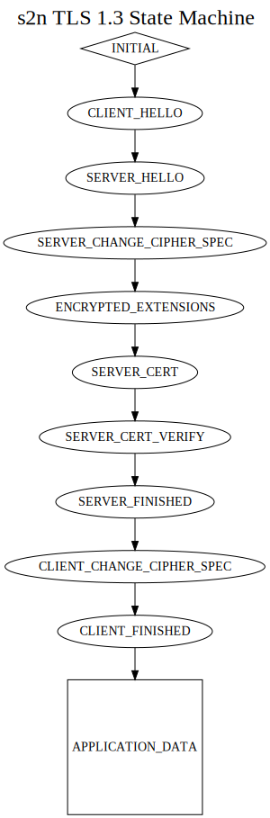

# s2n state machine graphs

## TLS 1.2 State Machine



## TLS 1.3 State Machine


### The above graphs can be generated by running

```
# sudo apt install graphviz if needed

make STATE_MACHINE_GRAPHS=1
```
