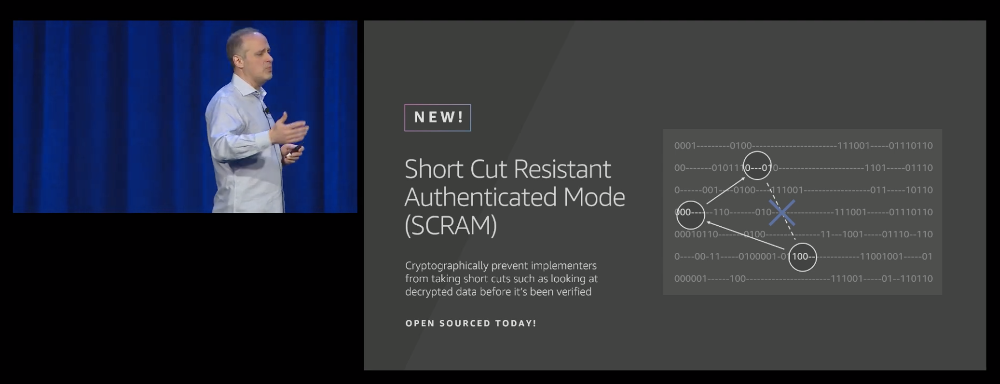

# Preview: SCRAM -- Short Cut Resistant AEAD Mode

SCRAM is a symmetric encryption mode, based on AES-GCM, that includes new
cryptographic protections against dangerous short-cuts that applications
sometimes take.

## Cryptographic protection against release of unauthenticated plaintext

Modern cryptographic libraries offer 'in place' encryption and decryption. By
avoiding copies of the memory, encrypting and decrypting data in place saves
both memory and CPU. While offering great performance, this interface depends
on a promise from the application developer not to use or look at the decrypted
plaintext until it has been authenticated by the cryprographic library.
Application developers do not always appreciate that this authentication occurs
only once the entire message has been received, and that it is not safe to
process the data until then. 

There are two variants of this mis-use:

1. Some applications do not perform the final 'authenticate this data'
operation, or do not check the return status of this operation. Although
encryption libraries such as Amazon s2n do include tests that simulate malicous
attackers injecting corrupted traffic, this is not a common or easy kind of
test for applications to include. An application with this error will appear to
work correctly, and will handle correctly encrypted and authenticated data
without error, however the application will also accept corrupt or malicious
input; usually a high severity security issue.  

2. Some applications deliberately use decrypted plaintext before it has been
authenticated, in order to get a 'head start' on work. For example, an
application may decompress a compressed payload before it has been
authenticated, or may optimistically execute a dependent operation such as a
web-request. The application developers may believe that this is 'ok' as long
as the work is 'cancelled' or 'undone' should the message fail authentication.
However this is rarely done with a full appreciation for the information
side-channels that are introduced by optimistic operations, or the inherent
risk of denial of service attacks. 

SCRAM adds mis-use resistance for both kinds of issues. 

When using SCRAM, a recipient simply must first (correctly) compute the message
authentication code in order to subsequently decrypt it.  There is no
significant benefit to skipping this step. If an application does fail to check
the result of the message authentication operation, and uses the 'decrypted'
data prematurely, the corrupt message will result in a 'random garbage'
plaintext. Crucially, an attacker has no control over this random garbage.

For applications that are using SCRAM to simply encrypt bulk data, this kind of
application failure still results in data corruption. But for applications that
are using SCRAM to encrypt data that must conform to a schema, or data that
contains instructions, this kind of application failure is generally much
safer. Without any control over the data that is decrypted, an attacker's
ability to abuse the application failure, or to find meaningful decryption or
message forgery oracles is severely limited.

## Integration of message padding into the AEAD layer

Modern cryptography is extremely good at disguising data as meaningless noise,
however analysis of encrypted data volumes and traffic timings remains the most
practical attack on well-encrypted information.

Without any measures to prevent these attacks, the size and timing of encrypted
messages can be enough information for an attacker (who has access to the
encrypted data) to decipher a voice call, determine the keystrokes used in a
password, or to identify content being accessed by using size-based
fingerprints.

To enhance protection against these risks, SCRAM integrates message padding
directly into the AEAD encryption layer. The caller indicates a desired 'frame
size' and SCRAM will ensure that every encrypted message is rounded up (if
needed) to a whole number of frames. Frames can be aligned with network
boundaries, such as record sizes or TCP segment sizes, or they can be aligned
with storage boundaries such as page sizes or block sizes. It's up to the
application.

By integrating padding, SCRAM handles the details that developers can sometimes
get wrong, for example many application developers mistakenly believe that a
random amount of padding is sufficient to hide the length of a message. 

Applications using SCRAM don't have to use padding, it's not enforced, but
adding padding to the AEAD layer acts as a noteworthy reminder to application
developers and code-auditors that obfuscation of message sizes and timings is
an important consideration for cryptographic systems. For example, it will
be noticable during a code-review that padding has not been chosen.

## SCRAM algorithm

SCRAM is being developed as part of Amazon s2n and is open source. The working
specification of the SCRAM algorithm is maintained in Python. 

There are several ways of achieving SCRAM's cryptographic goals, but our
choices are heavily guided by ensuring that SCRAM's security proofs can be
simple, robust, and build on top of well-established properties of existing
cryptographic primitives.

The design of SCRAM is also intended to make use of operations that are already
accelerated in hardware on common platforms including Amazon EC2 instances, the
AWS Nitro Platform, commidity and embedded systems.

SCRAM is not yet finalized; some performance sensitive details of SCRAM may
change as we experiment with different workloads and datasets. We are always
open to feedback from application developers about how SCRAM may be useful in
their applications.

Once measurements and any changes are finalized, we will be publishing a final
SCRAM specification, accompanying security proofs, and other learnings.

## SCRAM material

* [Watch AWS CISO Stephen Schmidt announce SCRAM](https://www.youtube.com/watch?time_continue=2489&v=oam8FDNJhbE)

## SCRAM team

SCRAM is designed and maintained by Shay Gueron, Colm MacCarthaigh, and Alex
Weibel from the AWS Cryptography team. Shay Gueron is also a professor at the
University of Haifa.

