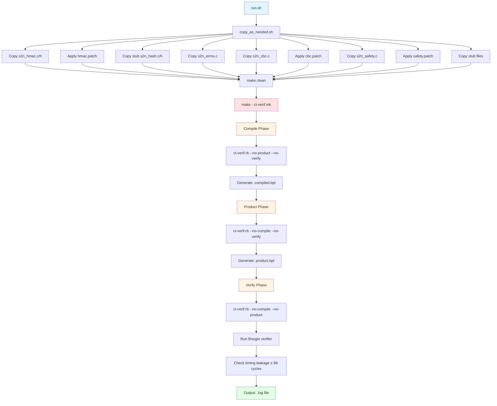

# Sidetrail Execution Flow

This diagram shows the execution flow for all sidetrail verification jobs. Each test follows the same pattern with test-specific source files and patches.

## Phases

1. **Setup** (`copy_as_needed.sh`): Copies source files and applies patches to add timing invariants
2. **Compile**: Converts C to Boogie intermediate language (.compiled.bpl)
3. **Product**: Creates self-composition product for timing analysis (.product.bpl)
4. **Verify**: Runs Boogie to verify timing leakage constraints

## Sidetrail Tests

All tests follow this same execution pattern:

- **s2n-cbc**: Verifies CBC cipher timing (leakage ≤ 68 cycles)
- **s2n-record-read-aead**: Verifies AEAD record reading timing
- **s2n-record-read-cbc**: Verifies CBC record reading timing
- **s2n-record-read-composite**: Verifies composite cipher record reading timing
- **s2n-record-read-stream**: Verifies stream cipher record reading timing
- **s2n-record-read-cbc-negative-test**: Negative test (expects verification failure)

## Performance Notes

Any slowdowns typically occurs in the **Verify phase** (Boogie solver) where heavy SMT solving happens. The `smtlog += p.smt2` in Makefiles logs SMT queries for debugging.

## Configuration Options

Each test's `Makefile` can set:
- `unroll`: Loop unroll limit (controls state space size)
- `looplim`: Loop analysis limit
- `time`: Timeout in seconds
- `timing`: Enable timing analysis
- `smtlog`: SMT query log file
